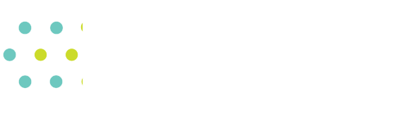

casm-project
============

**Note**: casm-project is under development and not yet released. The interface may change in future releases.

The casm-project package makes it easier to construct, fit, and use a cluster expansion in CASM version >= 2 by:

- providing quick access to the most commonly used methods,
- automatically reading project data needed by those methods from a CASM project directory,
- automatically writing the results to the standard location in a CASM project directory.

Using casm-project to store project data in standard locations makes it easier to understand what was done and share the project with others.

About CASM
==========

The casm-project package is part of the CASM_ open source software package, which is designed to perform first-principles statistical mechanical studies of multi-component crystalline solids.

CASM is developed by the Van der Ven group, originally at the University of Michigan and currently at the University of California Santa Barbara.

For more information, see the `CASM homepage <CASM_>`_.

License
=======

GNU Lesser General Public License (LGPL). Please see the LICENSE file available on GitHub_.

Documentation
=============

.. toctree::
    :maxdepth: 2

    installation
    usage
    Reference <reference/casm/index>
    bibliography

casm-project is available on GitHub_.

.. _CASM: https://prisms-center.github.io/CASMcode_docs/
.. _GitHub: https://github.com/prisms-center/casm_project
